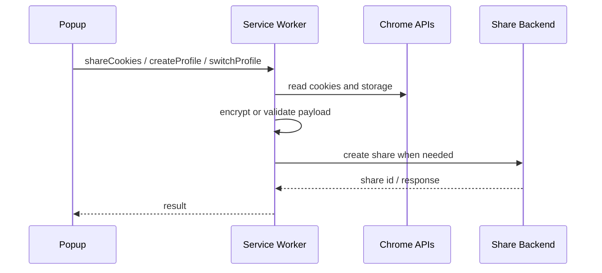
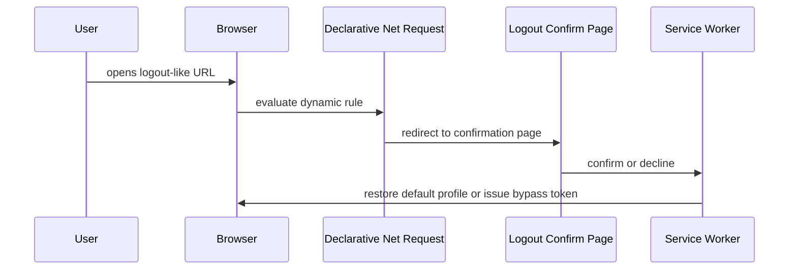

# Architecture

Sync2Access is organized around a Manifest V3 service worker, a React popup UI, a content script bridge, and a logout confirmation page.

## Runtime Components

| Component | Path | Responsibility |
| --- | --- | --- |
| Popup app | `sync2access/src/popup` | User interface for sharing, profiles, settings, theme and language selection |
| Service worker | `sync2access/src/background/service-worker.ts` | Message router, cookie operations, profile switching, share flow, DNR lifecycle |
| Profile manager | `sync2access/src/background/profile-manager.ts` | Cookie profile CRUD, per-domain locks, import/export |
| Crypto module | `sync2access/src/background/crypto.ts` | AES-GCM encryption, PBKDF2 key derivation, HMAC verification, RSA signature validation |
| DNR module | `sync2access/src/background/dnr-rules.ts` | Dynamic logout blocking rules and bypass handling |
| Content script | `sync2access/src/content/content-script.ts` | Safe page-to-extension message bridge |
| Logout confirmation | `sync2access/src/pages` | User-facing confirmation before logout navigation proceeds |

## Message Flow

## Logout Protection Flow

## Data Storage

| Storage | Data |
| --- | --- |
| `chrome.storage.local` | Cookie profiles, active profile ids, logout settings, UI preferences |
| `chrome.storage.session` | Pending share data and short-lived transfer state |
| In-memory maps | Bypass tokens and rate limiting counters inside the service worker lifecycle |

## Security Model

- Cookie values are encrypted before share payloads are stored or sent.
- Public shares still use a default encryption password, while private shares derive keys from the user password.
- HMAC authenticates encrypted cookie arrays.
- RSA signature verification protects supported import responses from tampering and replay.
- Bypass tokens are single-use and expire quickly.
- Import and profile operations validate domains and cookie attributes before writing to Chrome.

## Build Output

Vite emits the MV3-ready files to `sync2access/dist`, including:

- `manifest.json`
- `service-worker.js`
- `content-script.js`
- `popup.html`
- `logout-confirm.html`
- hashed UI assets
- `_locales`
- icons
- DNR rule resources
